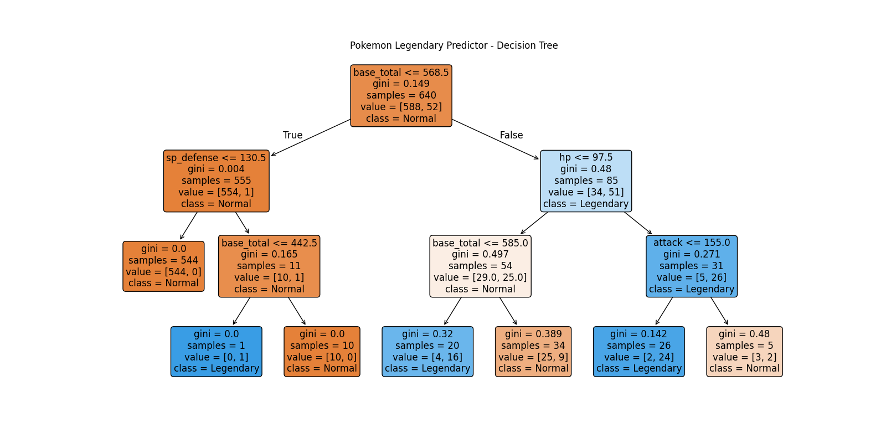
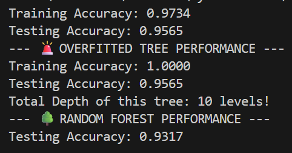
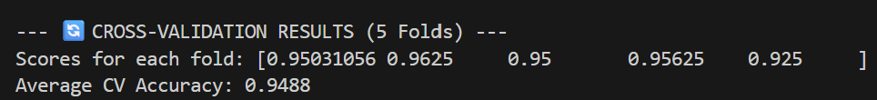
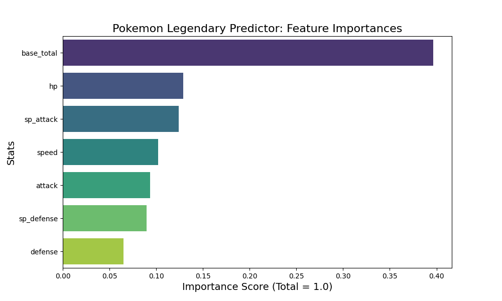

# 🐉 Pokemon Legendary Predictor: Tree-Based Models

## 📌 Project Overview
This project implements Machine Learning classification pipelines using **Decision Trees** and **Random Forests** to predict whether a Pokémon is 'Legendary' (1) or 'Normal' (0) based purely on its combat base stats (HP, Attack, Defense, Speed, etc.). 

Through this project, I practically explored the mechanics of tree-based models, visualized decision-making rules, tackled the problem of **Overfitting**, and utilized **Ensemble Learning (Bagging)** via Random Forests to achieve a stable, highly accurate prediction model.

## 🛠️ Technologies & Libraries Used
* **Python 3.x**
* **Pandas:** Data manipulation and feature selection
* **Scikit-Learn (sklearn):** `DecisionTreeClassifier`, `RandomForestClassifier`, `cross_val_score` for K-Fold Cross Validation, and tree visualization tools.
* **Matplotlib & Seaborn:** Generating tree plots and feature importance bar charts.

## 🚀 Pipeline Steps & Key Insights

### 1. Decision Tree Visualization
I trained an initial Decision Tree classifier and visualized its internal logic. The model acts like a flowchart, splitting data based on conditions like `base_total <= 580`. This makes the model highly interpretable, showing exactly how decisions are made at each node while tracking Gini impurity.

### 2. Analyzing Overfitting
To understand the limitations of a single Decision Tree, I allowed a tree to grow without any depth restrictions (`max_depth=None`). 
* **Result:** The model memorized the training data perfectly (100% Training Accuracy) reaching 10 levels deep, but failed to improve on unseen data (Testing Accuracy). This was a practical demonstration of **Overfitting**.

### 3. Random Forest & Cross-Validation
To solve the overfitting issue, I implemented a **Random Forest Classifier** consisting of 100 individual decision trees (Bagging). 
* I further evaluated the model using **5-Fold Cross-Validation** to ensure the model wasn't relying on a "lucky" train-test split.
* **Result:** The model achieved a highly stable Cross-Validation accuracy of **~94.8%**, proving its reliability on unseen data.

### 4. Interpreting Feature Importance
Unlike black-box models, Random Forests allow us to extract the "Importance" of each feature. I plotted these scores to understand the business logic behind Legendary Pokémon:
* **`base_total` (~39.6%):** The overall stat pool was the strongest indicator.
* **`hp` (~12.9%) & `sp_attack` (~12.3%):** Health points and special magical attacks were the next most critical features, perfectly aligning with Pokémon lore.

